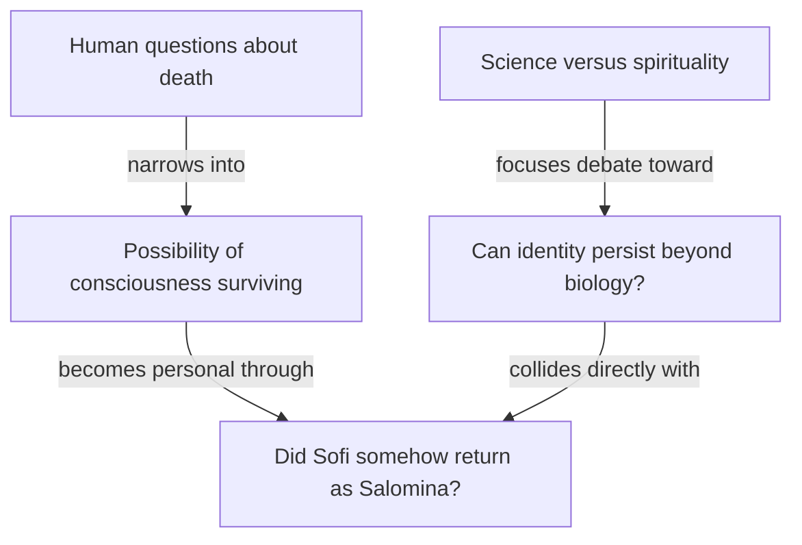

---
{"dg-publish":true,"permalink":"/mermaid-diagrams/","dg-note-properties":{}}
---

We are testing how Mermaid Diagrams work in my Obsidian Digital garden

```mermaid
flowchart TD
    A["Human questions about death"] -->|narrows into| B["Possibility of consciousness surviving"]
    C["Science versus spirituality"] -->|focuses debate toward| D["Can identity persist beyond biology?"]
    B -->|becomes personal through| E["Did Sofi somehow return as Salomina?"]
    D -->|collides directly with| E

```

